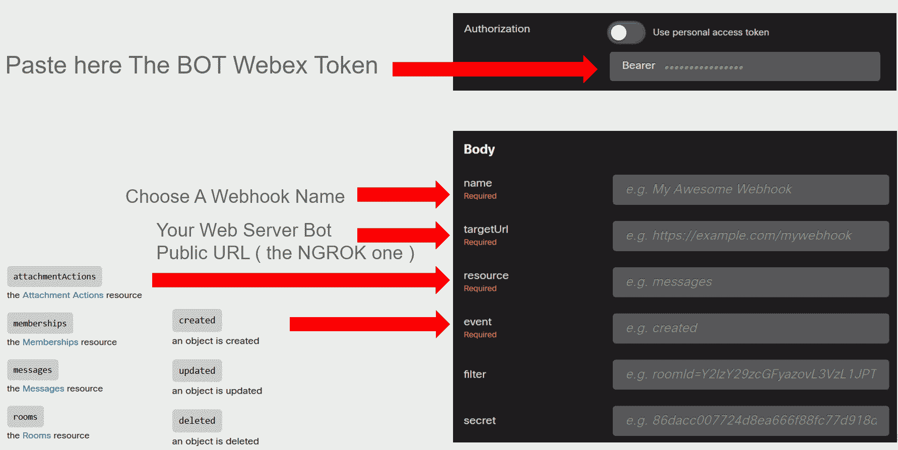
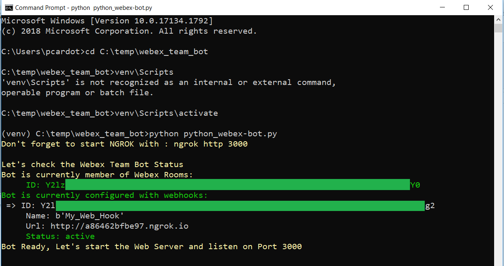
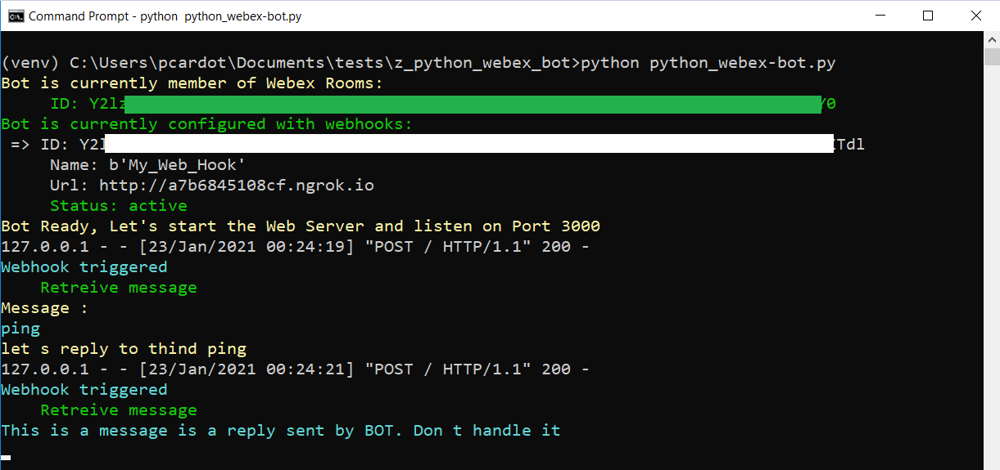

# Introduction

In this repo you will find instructions for :

- Creating a Webex Team Bot 
- Adding a Webhook to your Webex Team Bot.
- Installing a Pedagogic Python Web logic to your Webex bot. 
- Interact with your bot through it's own Webex Team Room.

The goal of this article is mainly help you to understand how webex bot works and how to start one quickly.

# Create a Webex Team Bot

Webex Team Bot are very good interfaces for applications which doesn't have any GUI or output console ( Python scripts or SecureX Workflows for examples ). It is worthit to understand how we could use it in our Networking and Security Applications.

The benefits of using a Webex Team bot is that it will have a permanent Webex Bearer Token. 

Let's create this bot.

Let's go to [Cisco Webex for Developper]('https://developer.webex.com/my-apps')

 

Click on the **start building apps** button and create an new application

Fill all requested fields and create your new bot.

Once created **COPY THE WEBEX BOT TOKEN !!**  and copy it's mail as well.

## Create a webhook

One of magic of Webex Team bots is that you can interact directly with them.  You can send them messages and they will answer to you !.

For doing this you need to attach a Webhook to the bot.

The Webex Webhook will allow to any web server to receive all the messages that will be sent to the bot room.

These messages will be copied when they will be received into the Webex Bot Room and sent to the Web server URL.

The Web Server can be any web server and the logic inside which can process the sent data by the webhook.

Actually the message is sent thanks to a HTTP **POST** call which act exactly as the calls used to send a formular to a web server.

That means that the web server will act exactly like any web server. It will read the variables sent thru this POST call and will process them.

The result of the data processing will be an HTTP result containing all information computed by the web server.

And these results will be sent to the webex team room thanks to Send Message API call to the room ID, with the Webex BOT BEARER TOKEN.

Let's have a look now to how to set up all this.

## The Webhook

Before talking about the bot logic, let's see how to create the webhook which will be used to hook the messages sent to the Webex Team Room

go to :

[Create a Webhook]('https://developer.webex.com/docs/api/v1/webhooks/create-a-webhook')

The **targetURL** must be your Web **Server public URL**

And use Your **Bot Webex BEARER TOKEN**

**resource = messages**

**event = created**

**targetUrl** is the full URL of your bot.Either you have a public Web Server... or not. If not, and for developpment purpose only, consider **NGROK**. NGROK makes Your developpment BOT located into your laptop available on the INTERNET in less than 5 minutes.

**Remark :** the **update_webhook.py** file can help you to automate your bot targetUrl.

[Configure the project to run on your local PC]('https://developer.cisco.com/learning/lab/collab-spark-botkit/step/4')

## The BOT Webex Room

Starting from now, we are going to use the BOT Webex Room, in order to interact with it.

Go to your Webex Team and **contact** your bot thanks to it's mail.

And enter to the Bot's room. 
As test, You can send some test messages into the room.  

At this point Nothing special will happen except your message sent to the bot.

For information we need the Bot Room ID in order to send to it messages from any script. This room id will be automatically discoverer by our script. You don't need to search for it.

## The Bot Logic

The Webex Team Bot logic attached to the Webex Team Bot, is just a web server which listens to webhook calls. Everytime a message is send into the Bot's room, a webhook call is sent to a target URL that will be our Bot Logic Web Server.

This Bot Logic Web Server is actually the **webex-bot.py** python file. If you open it you will see that it is based on the simple HTTP.request module. 

## Make Your Bot Logic available on the INTERNET

We need to make our bot logic publicly available for Webex.

**NGROK** is a wonderful tool for doing that in minutes. NGROK exposes a public URL on the INTERNET and built a tunnel between this public location and an application within your laptop.

### install NGROK

https://ngrok.com/download

Open a new CMD console window.  Change directory to the folder where you unzipped ngrok and start it thanks the following command.

    cd {ngrok directory}
    ngrok http 3000

We will see later that our bot logic will listen on port 3000.

Copy the NGROK FQDN that was assigned to you ( it will remain available during 7 hours ), we will used it later.

Perfect,  We are now ready  to go to the next step that is to install and start our bot logic server.

## Install and start your bot logic web server

Create a working directory named **bot_logic** into your laptop, and cd to it.

Open a terminal window ( Windows CMD console )

For Windows:

    md bot_logic
    cd bot_logic

For Linux

    mkdir bot_logic
    cd bot_logic
    
### Start your python virtual environment

For Linux/Mac 

	python3 -m venv venv
	source venv/bin/activate

For Windows 

	virtualenv env 
	\env\Scripts\activate.bat 
	
or
	
	python -m venv venv 
	venv\Scripts\activate

### clone the bot logic code

Then clone the code :

    git clone https://github.com/pcardotatgit/Webex_Team_Chat_Bot_Python.git

Change directory to the bot logic folder:

    cd Webex_Team_Chat_Bot_Python

### Install Python Modules

    python -m pip install --upgrade pip
    pip install -r requirements.txt

## Edit the config.py initialization file

**config.py** is an init file that contains Your Webex Team Bot details. 

Edit this file and assign the correct values to the listed variables

- bot_email = "ex:my_python_bot@webex.bot"
- bot_name = "ex:my_python_bot"
- bearer = "THE_Webex_Bot_Bearer_token_here"
- webhook_url = 'targetUrl here ex:http://db19a7dc123.ngrok.io'
- webhook_name = 'ex:My_Web_Hook'

### Start your bot logic 

    python webex-bot.py

As you can see, the application tells you that it is listening on port 3000.	
You can change that in the python script ( Line 222 )

	httpd = HTTPServer(('localhost', 3000), SimpleHTTPRequestHandler)
	
And don't forget to start NGROK on that port.

**Let's test the bot !**

At this point, we can test that the bot work.

Go the Bot Webex Room and send **ping** into it.

Now you should receive back the message : **PONG !**

And you can check the python bot console

Same in the NGROK console

Now send **help** into the Bot's room and have a look to the result

## Add New functions to your bot logic

As your bot logic works, you can modify it's behavior.

Edit the **webex-bot.py** file and go to the **def do_POST(self):** function. Modify the if statement with new keywords and actions to be executed in the conditionnal branch

Ok it's up to YOU now !!

## Credits

- https://github.com/dmkazakoff/WebexTeams-Investigation-Bot
